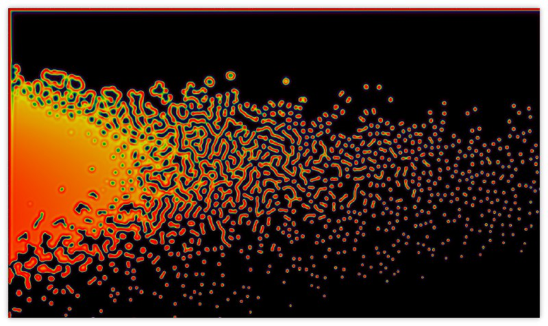

# Reaction diffusion with C++ and SFML

Supports switching to HSV colors and kill,feed and difusion rates dependent on position

Spacebar to pause/unpause

SFML version: 2.4.2

Build folder contains compiled version for linux

Example from video:

Variable kill and feed rates:

 
Variable dission rates:

